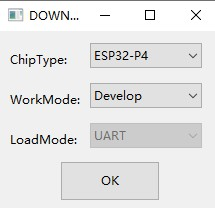
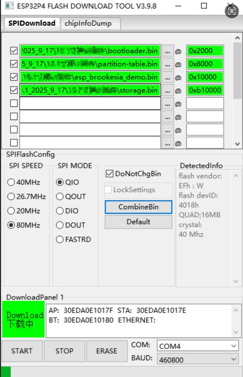

# How to install the factory demo firmware with flash download tool?

#### 1.Preparation:

- USB C cable
- Laptop/PC
- CrowPanel Advanced 7inch ESP32-P4 HMI AI Display
- Flash download tool

Check whether the materials on the PCBA board are defective. Such as less material, false welding, tin and other bad phenomena.

#### 2.Flash the firmware 

##### Step1 Connect the ESP32 P4 display to the laptop/PC with USB-C cable. The power indicator will light up.

##### Step2 Open the flash download tool. 

For the  Crowpanel Advance HMI ESP32 P4  AI Display, the chip select ESP32-P4:

##### Step3

①Choose the firmware files;

②Enter the address: 

bootloader.bin------0x2000

partitions-table.bin--------0x8000

esp_brookesia_demo.bin------0x10000

storage.bin-------0xb10000

③Check the firmware files;

④Select the correct port number;

⑤Click “Start” to download

##### Step4 Press the reset button to show the demo.
